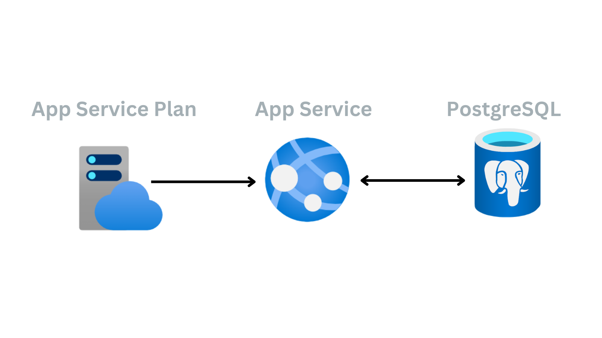

# Python (Flask) Web App with PostgreSQL and Key Vault

Artists Booking Venues powered by Python (Flask) and PostgreSQL Database.
There is no user authentication or per-user data stored.


The project is designed for deployment on Azure App Service with a PostgreSQL flexible server. See deployment instructions below.

[](https://codespaces.new/john0isaac/flask-webapp-postgresql-db?devcontainer_path=.devcontainer/devcontainer.json)



## Local Development


1. **Download the project starter code locally**

  ```bash
  git clone https://github.com/john0isaac/flask-webapp-mysql-db.git
  cd flask-webapp-mysql-db
  ```

2.**Initialize and activate a virtualenv using:**

```bash
python -m virtualenv venv
source venv/bin/activate
```

>**Note** - In Windows, the `venv` does not have a `bin` directory. Therefore, you'd use the analogous command shown below:

```bash
source venv/Scripts/activate
deactivate
```

3.**Install the dependencies:**

```bash
pip install -r requirements.txt
```

4.**Run the development server:**

```bash
export FLASK_APP=app.py
export FLASK_ENV=development
export FLASK_DEBUG=true
flask run --reload
```

5.**Verify on the Browser**

Navigate to project homepage [http://127.0.0.1:5000/](http://127.0.0.1:5000/) or [http://localhost:5000](http://localhost:5000)

## Google Cloud Deployment

1. Open the Google Cloud Shell and execute the following command:

  ```shell
  git clone https://github.com/john0isaac/flask-webapp-postgresql-db.git
  cd flask-webapp-postgresql-db
  ```

2.Create the env_variables.yaml file that contains your secret environment variables.

  ```shell
  nano env_variables.yaml
  ```

3.Add your Google Cloud SQL database connection details

```shell
env_variables:
  DB_USER_NAME: 'secret'
  DB_PASSWORD: 'secret'
  DB_NAME: 'secret'
  DB_HOST: '111.111.111.111'
  DB_PORT: '5432'
  DB_CONNECTOR: 'postgresql+pg8000'
  INSTANCE_UNIX_SOCKET: '/cloudsql/Connection name'
  DEPLOYMENT_LOCATION: 'gcp'
```

4.save and exit the file CTRL+x followed by y followed by Enter.

5.Deploy the web application.

  ```shell
  gcloud app deploy app.yaml
  ```

### Deploying After Deleting Everything from Google Cloud

1. Create a Cloud SQL instance using the following parameters:
    - Specify instance name and password.
    - Select production instead of production plus.
    - Select Single Zone.
    - Specify the machine configuration of 2 vCPUs and 8 GB Memory.
    - Select the smallest storage option available 10 GB.
    - Add your IP to the Instance Network.
    - Select Create.
    - Create a database and call it fyyur.
    - Create a user and call it john.
    - Grant All privileges to user john.

2. Import Data dump.
3. Pull the code to the Cloud Shell.
4. Create environment variables .yaml file.
5. Enable App Engine.
6. execute the following command `gcloud beta app repair`.
7. execute the following command `gcloud app deploy --no-cache`.
